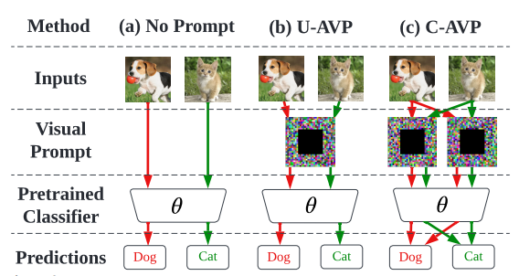

# Visual Prompting for Adversarial Robustness

This code belongs to this paper: [https://arxiv.org/abs/2210.06284](https://arxiv.org/abs/2210.06284)
For questions to the code, write an email to [chenaoch@msu.edu](mailto:chenaoch@msu.edu) or [peter.lorenz@itwm.fhg.de](mailto:peter.lorenz@itwm.fhg.de). Or even better open an issue on github so that everybody can see. 




Figure: Overview of C-AVP over two classes (red and green) vs. U-AVP and the prompt-free learning pipeline.


# Install 

`pip install -r requirements.txt`


# Usage


```
Code structure:
./
    attack/ # including all Fast-BAT & Auto Attack related attacks
    model/ # visual_prompt.py
    cfg.py # author style paths
    cifar10_pretrain.py # pretrain a CIFAR10 model
    gen_prompt.py # generate prompt
    evaluate_diff_pgd_steps.py # evaluate using different PGD steps
    losses.py # CW type loss
```

## Train ResNet18 on CIFAR10

`python cifar10_pretrain.py`

## Generate the Visual Prompt

Use only the CE-CW loss:

`python gen_prompt.py`


Use only the CE loss:

`python gen_prompt.py --loss ce`


# Results


Figure: Sensitivity analysis of prompting regularizations in C-AVP on (CIFAR-10, ResNet18).


# Citation


```
@inproceedings{
chen2022visual,
title={Visual Prompting for Adversarial Robustness},
author={Aochuan Chen and Peter Lorenz and Yuguang Yao and Pin-Yu Chen and Sijia Liu},
booktitle={Workshop on Trustworthy and Socially Responsible Machine Learning, NeurIPS 2022},
year={2022},
url={https://openreview.net/forum?id=c68ufJO9Xz8}
}
```
